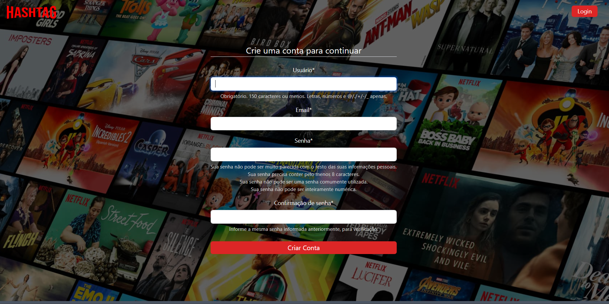
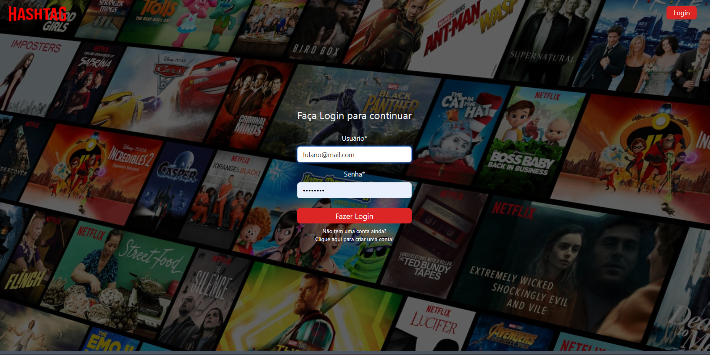
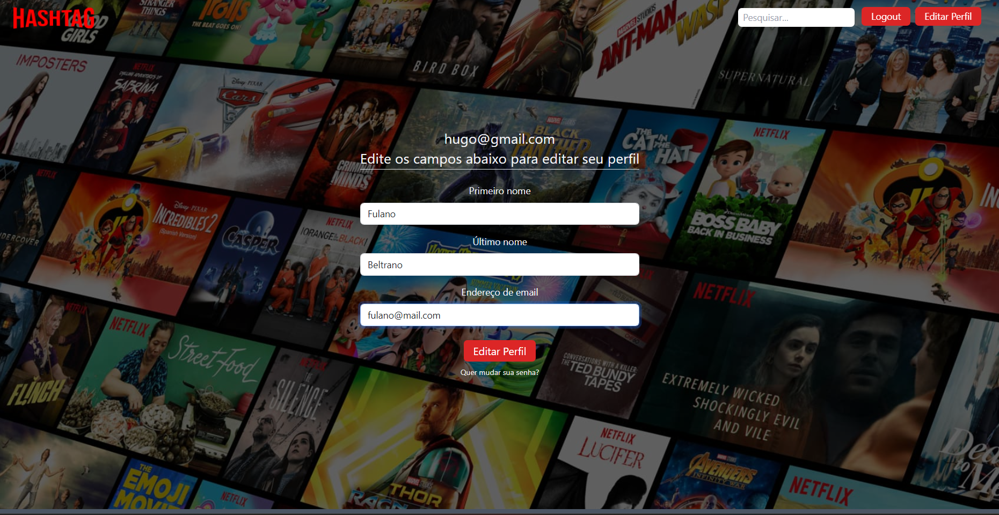

# Hashflix

## Project Description

This is a Web Development Project created utilizing the Django Framework for the back-end
development. For the front-end Tailwind and Bootstrap were used.

### Packages used:
+ django
+ django.apps
+ django.db
+ django.utils
+ django.contrib.auth.models
+ django.contrib.auth.forms
+ django.shortcuts
+ django.views.generic
+ django.contrib.auth.mixins
+ django.http
+ django.urls
+ django.contrib
+ django.contrib.auth
+ django.contrib.auth.admin
+ django.core.asgi
+ django.conf
+ django.conf.urls.static
+ pathlib
+ dj_database_url
+ os

## Project Structure

As this is a Django Project, the framework has a predetermined structure in which
every App related to the website has it's own directory. In this scenario we have two major
dictories:

+ "hashflix" directory which is responsible for the project management and settings;
+ "filme" directory which contain the main App related to the movies/series.

## Deployment

The project was deployment on Railway infrastructure platform as it allows for
free website deployments for simple applications.

## Homepage

## Create Account Page

## Login Page

## Home Movies/Series Page

## Movie/Series Detail Page

## Edit Profile Page

## Logout Page
